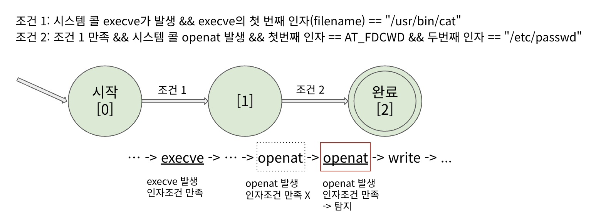

# Web Shell Detection

시스템 콜 패턴 추적을 이용한 의심스러운 web shell 행동 탐지 도구

WIP

## Introduction

이 프로젝트는 웹 애플리케이션 서버에 웹 쉘 설치이후에 발생하는 의심스러운 웹 쉘 행위를 탐지하는 탐지도구 입니다. 서버 프로세스 에서 발생하는 시스템 콜의 패턴을 인식하는 방식으로 동작하여 정교하게 악성 행위를 식별해낼 수 있습니다.

## Build

### Build
```shell
$ make main
```

### Test
```shell
$ make test
```

### 규칙 파일 적용
```shell
$ python python rule_codegen.py <rule_file_path>
```
#### exmaple:
```
$ python3 rule_codegen.py rules.example.yaml
```

## Internal

### 시스템 콜 추적

ptrace를 이용하여 탐지 대상 프로세스의 시스템 콜을 추적합니다. 탐지기(tracer)의 자식 프로세스로 탐지 대상 프로세스(tracee)를 실행하고, syscall entry와 exit시에 정지할 때 마다 인자 혹은 반환 값을 가져옵니다.
- syscall entry: 인자 값을 가져옴 (필요한 경우 자식 메모리에서 읽음)
- syscall exit: 반환 값과 일부 인자를 가져온 뒤 탐지 규칙을 매칭하기 위한 동작을 수행

새로운 프로세스가 발생할 수 있기 때문에 fork, clone 등 발생으로 인한 새로운 프로세스도 탐지 대상에 포함합니다.

### 탐지 규칙
탐지 규칙은 발생한 시스템 콜이 의심스러운 행위에 해당하는지 여부에 대해 판단하는 규칙입니다. 탐지 규칙은 아래 2가지 규칙으로 구성되어 있습니다.

#### 1. 시스템 콜 인자 규칙
발생한 시스템 콜의 인자 값이 정의된 규칙에 부합하는지 판단하는 규칙입니다. 예를 들어 `execve`의 첫 번째 인자 (`filename`)가 특정 실행 파일인지 판단하는 규칙이 가능합니다.

#### 2. 시스템 콜 순서 규칙
프로세스에서 지속적으로 발생하는 시스템 콜 흐름에서, 특정한 시스템콜이 호출되는 순서가 정의된 규칙에 부합하는지 판단하는 규칙입니다. 예를 들어 `execve` 시스템 콜 이후에 같은 프로세스에서 `openat` 시스템 콜이 발생된다면 `execve` 에 의해 실행된 실행파일이 특정 파일에 접근했다는 것을  알 수 있습니다. 이는 시스템 콜 인자 규칙으로 정확히 판단할 수 없는 경우를 보완합니다.

위 2가지 규칙은 결합 되어 사용됩니다. 예를 들어 `execve("/usr/bin/cat", ...)` 시스템 콜 발생 이후에 `openat(AT_FCWD, "/etc/passwd", ...)` 시스템 콜이 발생하는 경우를 규칙으로 삼는다면 `cat` 명령어가 `/etc/passwd` 에 접근하는 것을 탐지할 수 있습니다.

#### 예시
- 아래와 같은 조건 2가지로 규칙을 세우면 cat /etc/passwd 행위를 번거로운 인자 파싱 없이 탐지할 수 있음
- 조건1과 2 둘 다 만족시 탐지
- 같은 프로세스에서 발생한 시스템 콜 이라고 가정
> 조건 1: 시스템 콜 execve가 발생 && execve의 첫 번째 인자(filename) == "/usr/bin/cat"
> 
> 조건 2: 조건 1 만족 && 시스템 콜 openat 발생 && 첫번째 인자 == AT_FDCWD && 두번째 인자 == "/etc/passwd"



---

- This project contains LLM-generated code.
